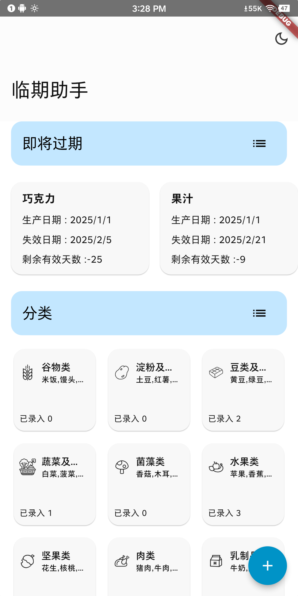
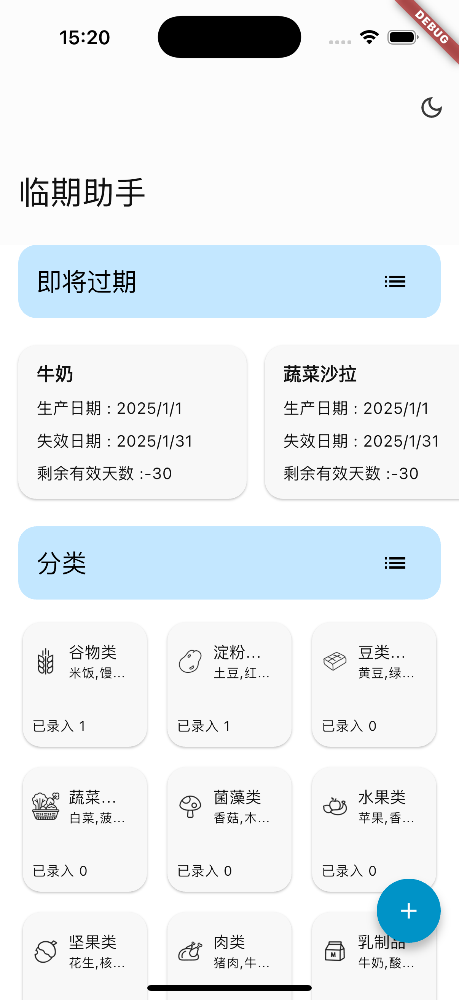
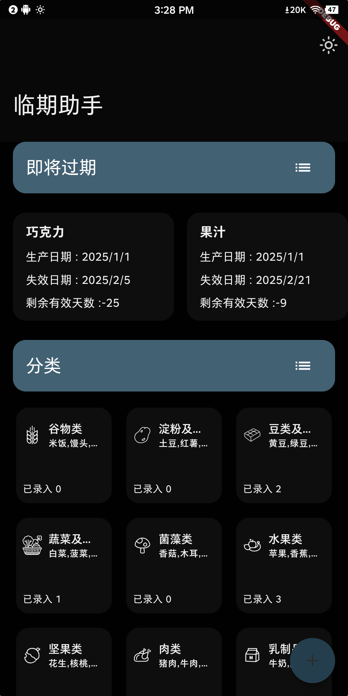
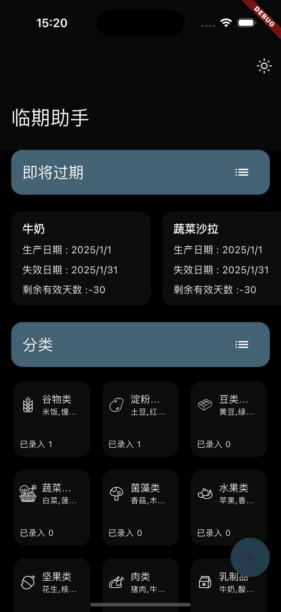
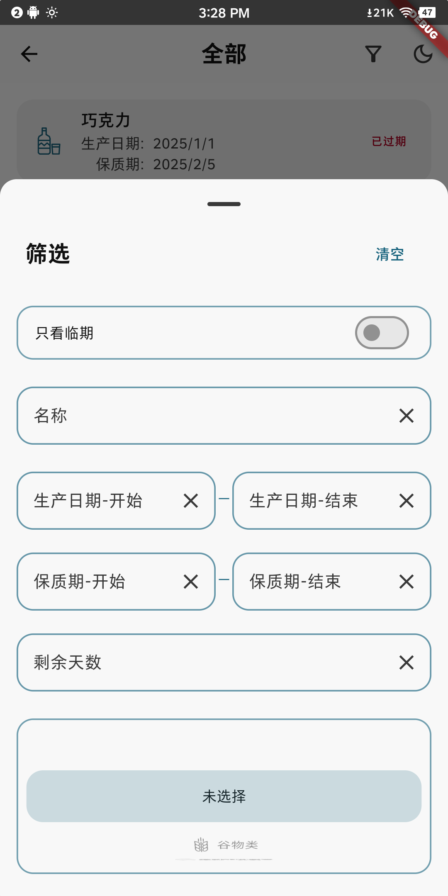
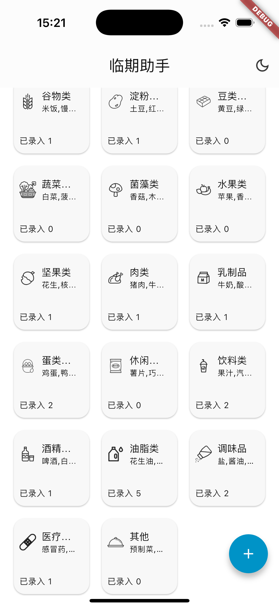
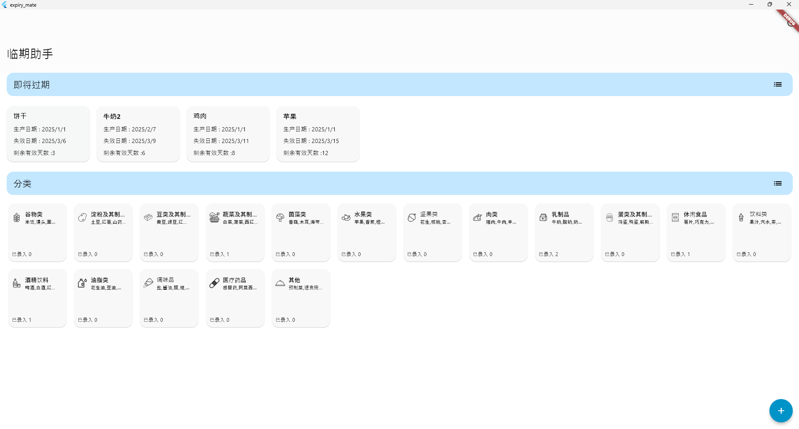
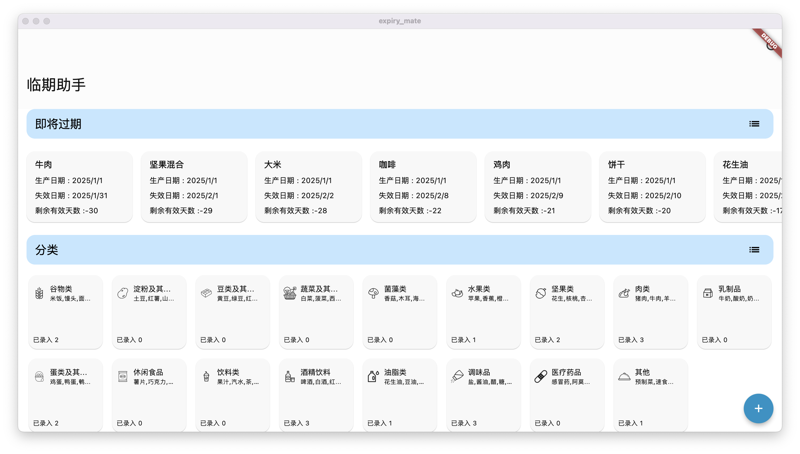
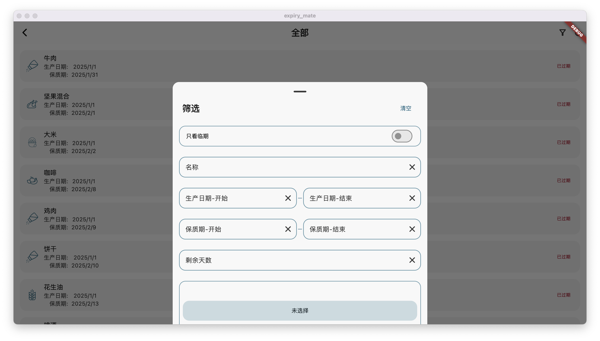
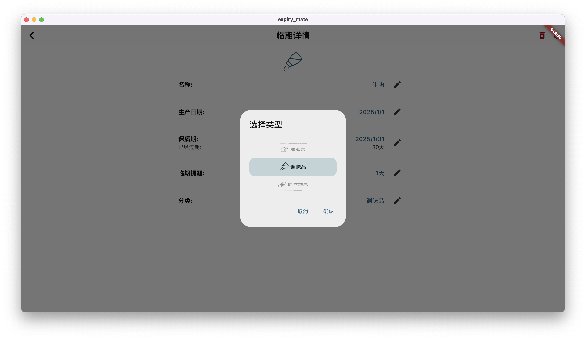

# 临期助手

帮助你记录家中会过期的产品。

## 开发环境

 

| 库       | 版本号    |
|:-------:|:------:|
| Flutter | 3.27.4 |
| Dart    | 3.6.2  |

[riverpod | Dart package](https://pub.dev/packages/riverpod)——进行状态管理

[objectbox | Dart package](https://pub.dev/packages/objectbox)——数据库存储

[flex_color_scheme | Flutter package](https://pub.dev/packages/flex_color_scheme)——实现主题更改。

本地我使用的是[FVM](https://github.com/leoafarias/fvm)管理Flutter版本号，在运行项目前先确认自己的开发环境Flutter版本为3.27.4。

```
 flutter pub get
```

项目中使用了[build_runner](https://pub.dev/packages/build_runner)，例如数据库`object_box`，资源生成[flutter_gen](https://pub.dev/packages/flutter_gen)，状态管理[riverpod](https://pub.dev/packages/riverpod)，序列化数据[freezed](https://pub.dev/packages/freezed)。

修改项目数据库，结构体，provider之后执行：

```
dart run build_runner build --delete-conflicting-outputs

```


## 已完成功能

- [x] 首页数据分类展示

- [x] 添加临期项目

- [x] 修改临期项目

- [x] 查看筛选内容

- [x] 夜间模式

- [ ] 国际化支持


## 截图

| Android                   | IOS                       |
|:-------------------------:|:-------------------------:|
|   |  | 
|   |  |
|  |  |

| Windows                                                             | MacOS                    |
|:-------------------------------------------------------------------:|:------------------------:|
|  |  |
|                                                                     |  |
|                                                                     |  |
